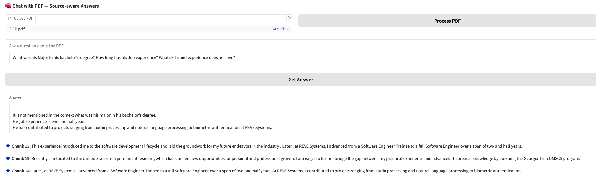

🧠 Chat with PDF using Mistral + FAISS + LangChain + Gradio

Ask questions from any PDF with source-aware answers powered by LLM and vector search.

🚀 Coming Soon

This project will be live on Hugging Face Spaces soon. Stay tuned for the interactive demo!

## System Design 🏗️

```plaintext
┌──────────────────────┐          ┌──────────────────────┐
│      User Interface  │          │   Document Processing│
│   (Gradio Web App)   │          │      Pipeline        │
├──────────────────────┤          ├──────────────────────┤
│                      │          │                      │
│  ┌────────────────┐  │  PDF     │ 1. PDF Text Extraction│
│  │   PDF Upload   ├──┼─────────►│   (PyPDF2)          │
│  └────────────────┘  │          │                      │
│                      │          │ 2. Text Chunking     │
│  ┌────────────────┐  │          │   (NLTK Sentence     │
│  │  Question Input├──┼──┐       │    Tokenization)     │
│  └────────────────┘  │  │       │                      │
│                      │  │       │ 3. Metadata Tagging  │
│  ┌────────────────┐  │  │       │   (Chunk ID Tracking)│
│  │  Answer &      │◄─┼──┘       └──────────────────────┘
│  │  Sources Display│  │                    ▲
│  └────────────────┘  │                    │
└──────────┬───────────┘                    │
           │                                │
           │                                │
           ▼                                ▼
┌──────────────────────┐          ┌──────────────────────┐
│   AI Inference       │          │  Vector Knowledge    │
│   Engine             │          │  Base                │
├──────────────────────┤          ├──────────────────────┤
│                      │          │                      │
│ 1. Contextual Prompt │          │  FAISS Index         │
│    Construction      │          │  (Hugging Face       │
│                      │          │   MiniLM-L6-v2       │
│ 2. LLM Response      │◄─────────┤  Embeddings)         │
│    Generation        │          │                      │
│   (Mistral-7B)       │          │                      │
└──────────────────────┘          └──────────────────────┘
```

RAG Example

